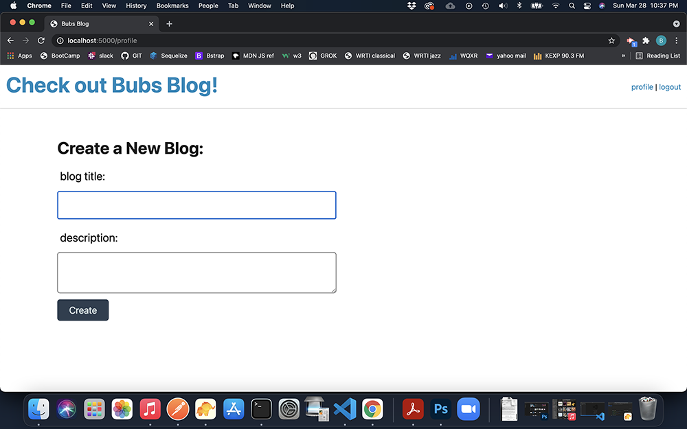
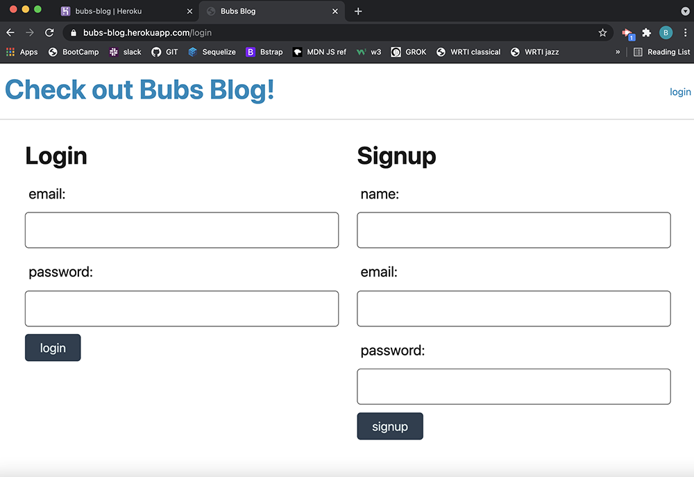

# Auth-blog

## Description
Sign in mechanism to reach the add blog page. Blogs displayed on the homepage.

## Table of Contents

* [Installation](#installation)

* [Usage](#usage)

* [License](#license)

* [Contributing](#contributing)

* [Contact](#contact)

-----------

## Installation
No installation. Go to https://bubs-blog.herokuapp.com/

_________

## Screenshots

**Above:**  *Opening Screen

_________

**Above:**  *Login Screen

_________

## Instruction Video

https://drive.google.com/file/d/1gLEQbUPAzOst-EnQaYmnye8tFp44Z4De/view
_________

## Usage
Take notes, save and delete.

_________

## License
MIT License - 
_________

## Contributing
Inquiries can be sent to me at my email address below.

# Contact
*********

* Github[Github]https://github.com/bjenkins63/Auth-blog

* Email[Email]mailto:studiojenkins@yahoo.com
_________
